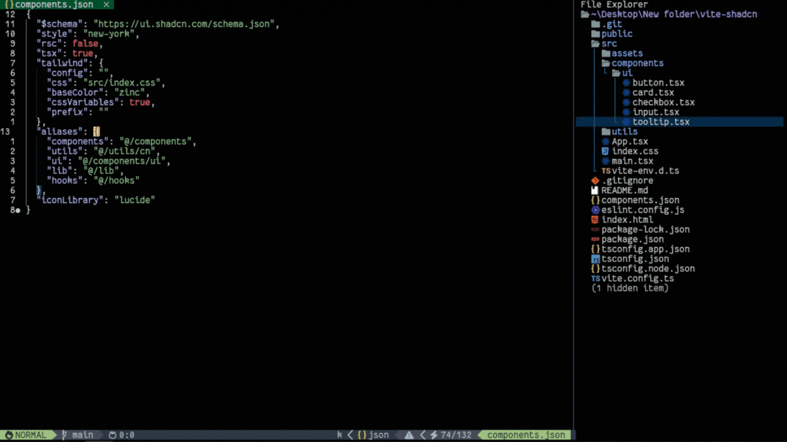

# nvim-shadcn

A Neovim plugin to add Shadcn UI components to your project with ease. This plugin integrates with Telescope to provide a user-friendly interface for selecting and installing shadcn components directly.

## Features

- **Simplified Initialization:** Initialize Shadcn UI easily.
- **Easy Component Installation:** Add Shadcn UI components from telescope.
- **Telescope Integration:** Browse and select components with a user-friendly interface.
- **Batch Component Addition:** Install multiple components at once.
- **Instant Documentation Access:** Open Shadcn UI documentation for any component directly from Neovim.
- **Essential Component Setup:** Install a pre-defined set of components with one command.

## Demo



## Prerequisites

- Neovim 0.8+
- [telescope.nvim](https://github.com/nvim-telescope/telescope.nvim)

## Installation

Using [lazy.nvim](https://github.com/folke/lazy.nvim):

```lua
{
  'BibekBhusal/nvim-shadcn',
  dependencies = {
    'nvim-telescope/telescope.nvim'
  },
  config = function()
    require('nvim-shadcn').setup({
      -- Configuration options here
    })
  end
}
```

## Configuration

The following is the default configuration for the plugin. You can customize it by modifying the options in the setup function:

```lua
require('nvim-shadcn').setup({
  default_installer = 'npm',

  format = {
    doc = 'https://ui.shadcn.com/docs/components/%s', -- or https://mynaui.com/components/%s
    npm = 'npx shadcn@latest add %s',
    pnpm = 'pnpm dlx shadcn@latest add %s',
    yarn = 'npx shadcn@latest add %s',
    bun = 'bunx --bun shadcn@latest add %s',
  },

  verbose = false,
  important = { 'button', 'card', 'checkbox', 'tooltip' }, -- this will be added when running `:ShadcnAddImportant`

  keys = { -- for telescope
    i = { doc = '<C-o>' },
    n = { doc = '<C-o>' },
  },

  init_command = {
    commands = {
      npm = 'npx shadcn@latest init',
      pnpm = 'pnpm dlx shadcn@latest init',
      yarn = 'npx shadcn@latest init',
      bun = 'bunx --bun shadcn@latest init',
    },
    flags = { defaults = false, force = false },
    default_color = 'Gray', -- Must be capitalized
  },

  telescope_config = {
    sorting_strategy = 'ascending',
    layout_config = {
      prompt_position = 'top',
      ...
    },
    prompt_title = 'Shadcn UI components',
  },
})
```

### Customization Options

- **`default_installer`**: Set the package manager to use for installing components. Options include `npm`, `pnpm`, `yarn`, `bun` or you can even add your own.
- **`format`**: Customize the command format for adding components and the documentation URL. You can modify the commands for each package manager as needed or even add new package manager.
- **`components`**: Includes all components from [shadcn documentation](https://ui.shadcn.com/docs) but if something is missing that can be added, all components can be seen list [here](lua/nvim-shadcn/components.lua).
- **`important`**: List of components to be added when running `:ShadcnAddImportant`.
- **`keys`**: Customize key mappings for opening documentation or installing with different package manager within telescope. The default is only for documentation set to `<C-o>`.
- **`init_command`**: Customize the init command for any package manager. Change base color, package manager and flags.
- **`telescope_config`**: Adjust the Telescope settings.
- **`verbose`**: Weather or not to print everything in the process.

### Using different Package manager Example

```lua
require('nvim-shadcn').setup({
    format = {
        solid = 'npx shadcn-solid@latest add %s',
        doc = 'https://shadcn-solid.com/docs/components/%s', -- Just URL format here
    },
    keys = {
        n = { solid = '<C-s>' }, -- using <C-s> in telescope will use solid for installing
        i = { solid = '<C-s>' },
    },

    --  default_installer = 'solid',
})
```

## Usage

`:ShadcnInit` - Initializes shadcn-ui in your project.

`:ShadcnAddImportant` - Adds the components listed in the `important` configuration.

`:ShadcnAdd` - Opens a Telescope picker to select a component to add.

`:ShadcnAdd <component_name>` - Adds the specified component directly. e.g. `:ShadcnAdd button` or even multiple `:ShadcnAdd button tooplip card`

## Keymaps

Setting up custom keymaps for adding element can be done this way:

```lua
vim.keymap.set('n', '<leader>sa', ':ShadcnAdd<CR>', { noremap = true, silent = true })
vim.keymap.set('n', '<leader>si', ':ShadcnInit<CR>', { noremap = true, silent = true })
vim.keymap.set('n', '<leader>sI', ':ShadcnAddImportant<CR>', { noremap = true, silent = true })
```

Or do it lazy way

```lua
{
    'BibekBhusal0/nvim-shadcn',
    opts = {},
    cmd = { 'ShadcnAdd' },
    keys = {
        { '<leader>sa', ':ShadcnAdd<CR>', desc = 'Add shadcn component' },
        { '<leader>si', ':ShadcnInit<CR>', desc = 'Init shadcn' },
        { '<leader>sI', ':ShadcnAddImportant<CR>', desc = 'Add important shadcn component' },
    }
}
```

### Telescope Keymaps

`doc`: Opens the documentation for the selected component from (default: `<C-o>`).

if you want to install component with different package manager you can set custom keymap for it like:

```lua
require('nvim-shadcn').setup({
    keys = {
        i = { yarn = '<C-y>' },
        n = { yarn = '<C-y>' }
    },
    ...
})
```

## License

This project is licensed under the [MIT License](LICENSE).

## Credits

[browser.nvim](https://github.com/lalitmee/browse.nvim)

[telescope](https://github.com/nvim-telescope/telescope.nvim/)

[shadcn/ui](https://ui.shadcn.com/docs)
